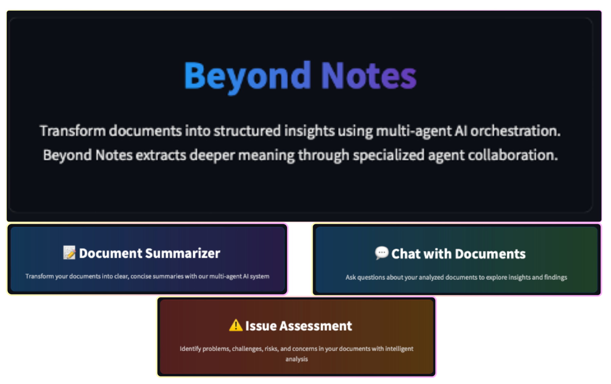

# `beyond-notes` 📝✨

> *"Built by humans. Reviewed by AI. Then corrected by more AI. It's collaborative chaos - that works."*

<p align="center">
  
</p>

Beyond Notes transforms documents into structured insights using a multi-agent AI system. It's an educational journey into how specialized AI agents can collaborate to extract deeper meaning than any single model could achieve on its own.

## Why Beyond Notes? 🤔

Standard AI approaches often miss the nuanced understanding that comes from specialized analysis. Beyond Notes intentionally implements an over-engineered architecture not because it's necessary for document processing, but because the insights gained from building multi-agent systems are invaluable as AI continues to evolve.

<p align="center">
  
</p>

## Core Capabilities

- **🔍 Distill** - Create focused summaries with progressive detail levels
- **📋 Extract** - Identify and organize action items, owners, and deadlines
- **⚠️ Assess** - Uncover issues, challenges, and risks with severity ratings
- **📊 Analyze** - Evaluate content against structured assessment frameworks

## Technical Approach 🧠

Beyond Notes implements several advanced AI techniques that demonstrate what's possible when you move beyond monolithic models:

### Multi-Agent Orchestration

Five specialized AI agents form a sequential processing pipeline, each focused on a specific task but collaborating through a shared context:

```python
async def _execute_pipeline(self, document: Document) -> None:
    # 1. Document Analysis
    await self._analyze_document(document)
    
    # 2. Document Chunking
    await self._chunk_document(document)
    
    # 3. Execute enabled stages
    for stage_name in enabled_stages:
        await self._execute_stage(stage_name)
```

- **🧭 Planner Agent** - Analyzes document structure and creates extraction strategies
- **🔍 Extractor Agent** - Identifies relevant information from document chunks
- **🧩 Aggregator Agent** - Combines findings and eliminates duplications
- **⚖️ Evaluator Agent** - Assesses information quality and importance
- **📊 Formatter Agent** - Creates the final structured output
- **🥇 Reviewer Agent** - Reviews output to validate against instructions

### Custom Model Context Protocol

The `ProcessingContext` class serves as the "brain" of the pipeline, implementing our own version of the Model Context Protocol:

```python
class ProcessingContext:
    """
    Context manager for multi-agent document processing with improved
    data management and monitoring.
    """
```

This provides:
- Centralized data storage accessible to all agents
- Evidence tracing to link findings with source material
- Progress tracking and performance metrics
- Document chunking and metadata management

<p align="center">
  
</p>

### Configuration-Driven Design

Beyond Notes uses a JSON-based configuration system to define assessment types:

```json
{
  "assessment_type": "assess",
  "assessment_id": "base_assess_issue_v1",
  "version": "1.0",
  "display_name": "Issue Assessment",
  "description": "Identifies problems, challenges, risks, and concerns in documents"
}
```

This enables customization without code changes and supports multiple workflow types.

## Key Insights from Building Beyond Notes ✨

### What We Learned

- **Context Management is Critical** - The shared processing context is what enables true collaboration between agents
- **Pipeline Architecture Superiority** - Sequential processing with specialized agents produces higher quality output than monolithic approaches
- **Evidence Tracing for Trust** - Linking insights back to source content creates verifiable, trustworthy output
- **Configuration Over Code** - JSON-driven workflows enable rapid iteration without technical debt
- **Progressive Enhancement** - Layering information through multiple passes creates richer, more nuanced understanding

### What We'd Do Differently

- **Agent Communication Protocols** - Future versions could implement more sophisticated inter-agent negotiation
- **Parallel Processing Opportunities** - Some pipeline stages could execute concurrently for performance gains
- **Output Format Customization** - More flexible output formatting based on use case needs
- **Memory Management** - Better handling of very large documents through streaming approaches

## Getting Started 🚀

```bash
# Clone repository
git clone https://github.com/Kris-Nale314/beyond-notes.git
cd beyond-notes

# Set up environment
python -m venv .venv
source .venv/bin/activate  # On Windows: .venv\Scripts\activate
pip install -r requirements.txt

# Set API key
export OPENAI_API_KEY=your_api_key_here

# Run the application
streamlit run app.py
```

## Application Structure 📑

- **🏠 `app.py`** - Entry point with navigation to different tools
- **🔍 `pages/01_Summarizer.py`** - Document summarization interface
- **⚠️ `pages/02_Issues.py`** - Issue assessment interface
- **📋 `pages/03_Chat.py`** - Chat with the document and output 
- **⚙️ `pages/04_Settings.py`** - Configuration management (coming soon)

## Core Components

- **🧠 `core/orchestrator.py`** - Coordinates the multi-agent pipeline
- **🔄 `core/models/context.py`** - Shared processing context management
- **👥 `core/agents/`** - Specialized agent implementations
- **📝 `assessments/`** - Assessment type definitions and templates
- **🛠️ `utils/`** - Shared utilities and UI components

## Why This Matters 🎓

Beyond Notes demonstrates several advanced AI concepts that are essential as we move toward more sophisticated AI systems:

- **Pipeline Architecture** - Sequential processing with specialized stages creates more robust systems
- **Service-Based Organization** - Clear separation of responsibilities enhances maintainability
- **Evidence Tracing** - Connecting insights to source material builds trust and verifiability
- **Configuration-Driven Design** - Flexible systems without code changes accelerate development
- **Document Chunking** - Handling content beyond token limits ensures comprehensive analysis

## Real-World Applications 🔮

While Beyond Notes is deliberately over-engineered for educational purposes, the techniques demonstrated have practical applications:

- **Meeting Transcript Analysis** - Extract key points, decisions, and action items
- **Research Paper Summarization** - Distill core findings and implications
- **Project Documentation Review** - Identify issues and recommendations
- **Contract Analysis** - Highlight important terms and considerations
- **Knowledge Management** - Transform unstructured content into structured insights

## Beyond the Hype: AI Is Not Magic ✨

This project demonstrates that AI capabilities emerge from thoughtful system design, not magical properties of large models. By breaking complex tasks into manageable components with clear responsibilities, we create more reliable, explainable, and effective AI systems.

---

*Beyond Notes is both a practical tool and an educational journey into multi-agent AI systems—demonstrating how breaking complex problems into specialized tasks yields deeper insights than monolithic approaches.*

<p align="right">
  <a href="https://github.com/Kris-Nale314">
    
  </a>
</p>